# Olymplics 2021 Data Engineering project using Azure

## Introduction

This project demonstrates a comprehensive data engineering and
analytical workflow using the Azure ecosystem to process and gain
insights from the Tokyo Olympic dataset. The project encompasses the
following key features and stages:

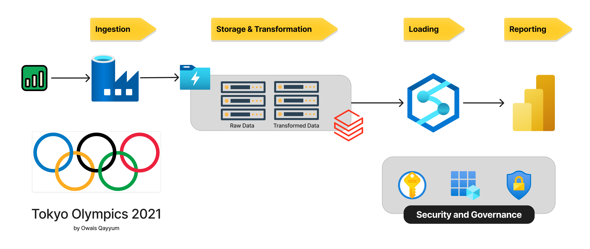


1. Data Ingestion:
   - Ingest the Tokyo Olympic dataset from a CSV file hosted on GitHub
     using Azure Data Factory.
   - Utilize data pipeline capabilities for reliable and efficient
     data retrieval.

2. Data Storage:
   - Store the ingested dataset in Azure Data Lake Storage Gen2,
     benefiting from its scalability and performance.
   - Leverage the secure and cost-effective storage solution optimized
     for big data analytics.

3. Data Transformation:
   - Transform and enrich the dataset using Azure Databricks, a fully
     managed Apache Spark platform.
   - Perform data manipulations, cleansing, and feature engineering to
     prepare the data for advanced analytics.

4. Enriched Data Storage:
   - Persist the transformed and enriched dataset back into Azure Data
     Lake Storage Gen2.
   - Maintain a centralized repository for the processed data,
     enabling integration with downstream analytics.

5. Advanced Analytics:
   - Perform advanced analytical computations on the enriched dataset
     using Azure Synapse Analytics.
   - Utilize distributed computing and SQL capabilities to uncover
     patterns, trends, and insights.

6. Data Visualization:
   - Visualize the derived insights using Azure Synapse Analytics or
     Power BI.
   - Create dashboards, reports, and visualizations to communicate the
     findings effectively to stakeholders.

By leveraging the Azure ecosystem, including Azure Data Factory, Azure
Data Lake Storage Gen2, Azure Databricks, Azure Synapse Analytics, and
Power BI, this project provides a comprehensive approach to process
and analyze the Tokyo Olympic dataset. The workflow ensures efficient
data ingestion, transformation, storage, advanced analytics, and
visualization, enabling data-driven decision making and valuable
insights.

## DataSet: Tokyo 2021 Olympic Games

The dataset utilized in this project provides a comprehensive
collection of information pertaining to the 2020 Olympic Games, which
were held in Tokyo in 2021 due to the COVID-19 pandemic. The dataset
encompasses a wide array of details related to the participants,
teams, and events of the Tokyo Olympics.

Key features of the dataset include:

1. Athlete Information:
   - The dataset contains records of over 11,000 athletes who
     participated in the Tokyo Olympics.
   - Each athlete's name, representing country, gender, and discipline
     are meticulously documented.

2. Discipline Coverage:
   - The dataset covers a total of 47 distinct disciplines,
     encompassing a diverse range of sports and events.
   - This extensive coverage allows for a comprehensive analysis of
     athlete performance across various domains.

3. Team Details:
   - The dataset includes information on 743 teams that took part in
     the Tokyo Olympics.
   - Each team's name, country of representation, and the number of
     athletes in the team are recorded.

4. Entries by Gender:
   - The dataset provides a breakdown of entries based on gender,
     enabling gender-based analysis and comparisons.
   - This information allows for an examination of gender
     representation and participation patterns in the Olympics.

5. Coaching Staff:
   - The names and details of the coaches associated with each team
     are included in the dataset.
   - This information facilitates the exploration of coaching dynamics
     and their potential impact on team performance.

The dataset's source is Kaggle, a renowned platform for data science
and machine learning enthusiasts.

https://www.kaggle.com/datasets/arjunprasadsarkhel/2021-olympics-in-tokyo

By leveraging this comprehensive dataset, the project aims to derive
meaningful insights, uncover patterns, and analyze various aspects of
the Tokyo Olympics. The richness and granularity of the data enable a
thorough examination of athlete performance, team dynamics, gender
representation, and the overall landscape of the 2020 Olympic Games
held in Tokyo.

## Azure Services Used

### Azure Data Factory (ADF):
Azure Data Factory (ADF) is used for data ingestion from the GitHub
repository. It reliably transfers the Tokyo Olympic dataset from the
CSV file to Azure Data Lake Storage Gen2.

### Azure Data Lake Storage Gen2 (ADLS Gen2):
Azure Data Lake Storage Gen2 (ADLS Gen2) serves as the central data
storage solution for the project. It provides a scalable and secure
environment to store and manage the ingested dataset.

### Azure Databricks:
Azure Databricks is employed for data transformation tasks. It enables
complex data processing, cleansing, and feature engineering using
Apache Spark's distributed computing capabilities.

### Azure Synapse Analytics:
Azure Synapse Analytics is utilized to perform advanced analytics on
the transformed dataset. It offers a unified platform for data
integration, analysis, and insight generation, combining the strengths
of SQL and Spark.

## Workflow

### Initial Setup
- Create Azure Free Subscription acoount
- Create a Resource Group 'tokyo-olympic-data' to house and manage all
  the Azure resources associated with this project.
- Within the created resource group, set up a storage account. This is
  specifically configured to leverage Azure Data Lake Storage(ADLS)
  Gen2 capabilities.
- Create a Container inside this storage account to hold the project's
  data. Two directories 'raw-data' and 'transfromed-data' are created
  to store raw data and transformed data.
  
  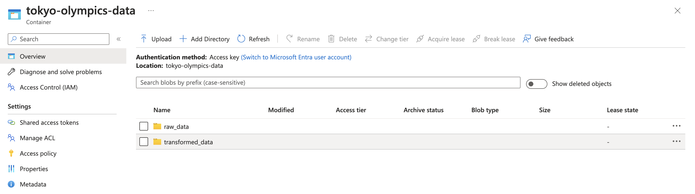


### Data Ingestion: Azure Data Factory
Data Ingestion with Azure Data Factory

#### Step 1: Create an Azure Data Factory Workspace
- Begin by creating a new Azure Data Factory workspace within the
  previously established resource group.
- Ensure that the workspace is configured with the necessary
  permissions and settings to enable data integration pipelines.

#### Step 2: Launch Azure Data Factory Studio
- After successfully setting up the Azure Data Factory workspace,
  launch the Azure Data Factory Studio.
- The studio provides a user-friendly interface for designing and
  managing data integration pipelines.

#### Step 3: Upload the Tokyo Olympics Dataset to GitHub
- Obtain the Tokyo Olympics dataset from Kaggle or any other reliable
  source.
- Upload the dataset to a GitHub repository, ensuring that it is
  accessible via HTTP requests.
- Make note of the GitHub repository URL and any necessary
  authentication details.
  
    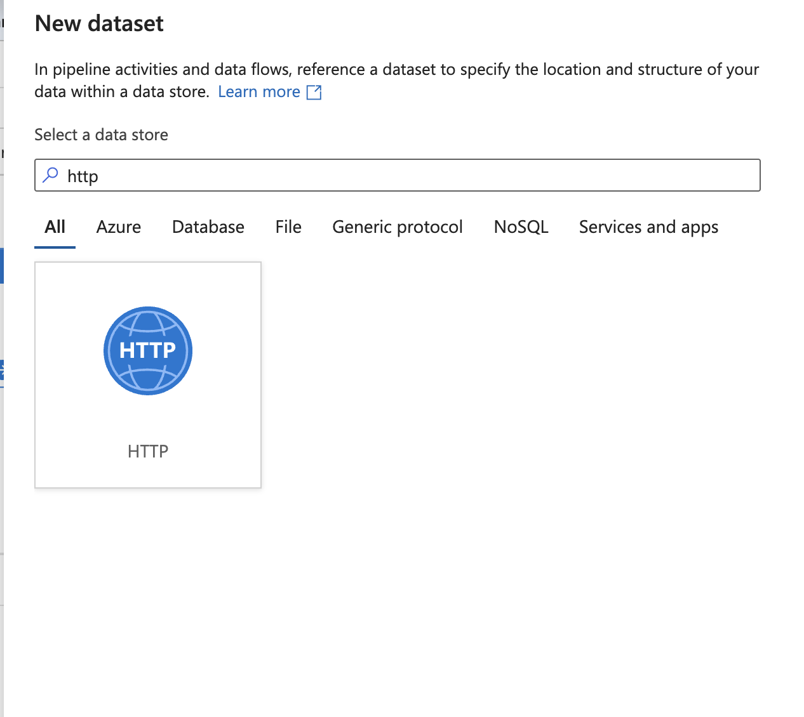

#### Step 4: Create a New Data Integration Pipeline
- Within the Azure Data Factory Studio, initialize a new data
  integration pipeline.
- Utilize the "Copy Data" task to efficiently move data between
  various supported sources and destinations.
- The "Copy Data" task allows for seamless data transfer from the
  GitHub repository to the desired destination.

#### Step 5: Configure the Data Source
- In the pipeline, configure the data source using the HTTP template.
- Specify the GitHub repository URL where the Tokyo Olympics dataset
  is hosted.
- If authentication is required to access the dataset, provide the
  necessary credentials or authentication tokens.

#### Step 6: Establish the Linked Service for Source
- Create a linked service within Azure Data Factory to establish a
  connection to the GitHub repository.
- Configure the linked service with the appropriate authentication
  mechanism (e.g., OAuth, personal access token) to securely access
  the dataset.

#### Step 7: Configure the File Format and Linked Service for Sink
- Specify the file format of the Tokyo Olympics dataset (e.g., CSV,
  JSON) in the sink configuration.
- Create a linked service for the destination storage account where
  the ingested data will be stored.
- Configure the linked service with the necessary connection details
  and authentication credentials.

#### Step 8: Repeat Steps 5-7 for All Datasets
- If the Tokyo Olympics dataset consists of multiple files or tables,
  repeat steps 5-7 for each dataset.
- Ensure that each dataset has its corresponding data source, linked
  service, and file format configured correctly.

#### Step 9: Connect and Run the Copy Data Activities
- In the pipeline, connect all the configured copy data activities in
  the desired sequence.
- Ensure that the activities are properly linked and the data flow is
  correctly defined.
- Validate the pipeline to check for any errors or missing
  configurations.
- Once the pipeline is set up, trigger the execution to start the data
  ingestion process.
- Monitor the pipeline execution progress and check for any failures
  or errors.
  
    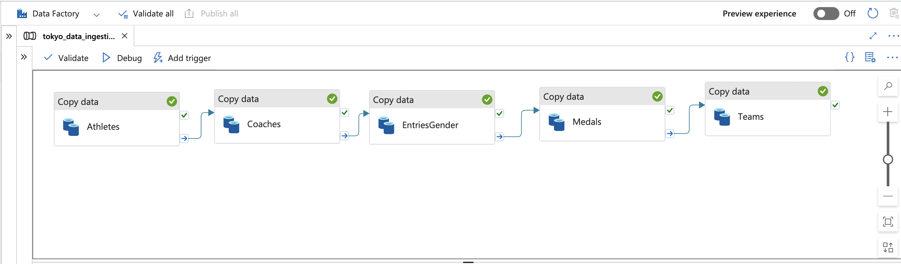
	
#### Step 10: Verify Data Ingestion in Azure Data Lake Storage Gen2
- Once the data ingestion pipeline has successfully completed its
  execution, navigate to your Azure Data Lake Storage Gen2 account.
- Locate the "raw_data" folder within the storage account, which
  serves as the designated destination for the ingested data.
- Inside the "raw_data" folder, you should find the ingested files
  from the Tokyo Olympics dataset, such as "athletes.csv",
  "medals.csv", and any other relevant files.
- Open each file and validate that they contain the expected data in
  the correct format.
- Ensure that the data has been accurately transferred from the GitHub
  repository to the Azure Data Lake Storage Gen2 without any data loss
  or corruption.
- Verify that the column names, data types, and overall structure of
  the ingested data align with the original dataset.
- If any discrepancies or issues are found, investigate the pipeline
  configuration and make necessary adjustments to ensure data
  integrity.
  
   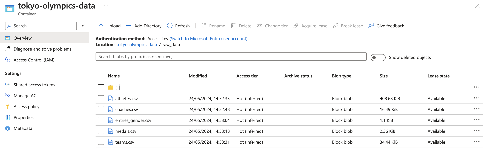

By following these step-by-step instructions, the Tokyo Olympics
dataset can be successfully ingested from the GitHub repository into
the designated destination using Azure Data Factory. The ingested data
will be stored in the specified storage account, ready for further
processing and analysis in the subsequent stages of the project.

### Azure KeyVault and App Registration
In this step we register a new application. This application will be
used to connect databricks to azure cloud or the resource group. Now
this applicaiton will have some secret keys and we cannot expose them
in our code in Azure databricks. Hence, we will save these secret
values like application id, secret id and tenant id in the key
vault. Later in the azure databrciks we can simple access these values
without exposing the secret keys.

then using the secret scope we can simply add the azure databricks
deployment link instead of the
databricks-instance.

https://<databricks-instance>#secrets/createScope

This will take us to the create secret scope page where we can create
the secret scope.

### Data Transformation: Azure Databricks

#### Step 1: Create and Launch Azure Databricks Workspace
- Navigate to Azure Databricks within the Azure portal.
- Create a new Databricks workspace within the previously established
  resource group.
- Launch the Databricks workspace to access the Databricks
  environment.

#### Step 2: Configure Compute in Databricks
- Set up the necessary compute resources in Databricks.
- Create a new cluster or utilize an existing one with the required
  specifications.
- Ensure that the cluster has the appropriate settings and libraries
  to support data transformation tasks.

#### Step 3: Create a New Notebook
- Within the Databricks workspace, create a new notebook.
- Rename the notebook to reflect its purpose or the dataset it
  pertains to.
- Choose the appropriate language (e.g., Python, SQL) for writing data
  transformation code.

#### Step 4: Establish Connection to Azure Data Lake Storage (ADLS)
- Obtain the necessary credentials for connecting to ADLS, including
  Client ID, Tenant ID, and Secret.
- Configure the Databricks notebook to establish a connection to ADLS
  using the provided credentials.
- Ensure that the connection is secure and properly authenticated.

#### Step 5: Mount ADLS in Databricks
- Write the appropriate code in the Databricks notebook to mount ADLS.
- Use the obtained credentials (Client ID, Tenant ID, Secret) to
  authenticate the connection.
- Specify the desired ADLS file system and path where the data is
  stored.
- Verify that the mounting process is successful and the data is
  accessible from Databricks.

```python
# Import required libraries
from pyspark.dbutils import DBUtils
from pyspark.sql import SparkSession

# Initialize Spark session and DBUtils
spark = SparkSession.builder.getOrCreate()
dbutils = DBUtils(spark)

# Get the secret values from the secret scope
application_id = dbutils.secrets.get(scope="key-vault-scope", key="applicationid")
client_secret = dbutils.secrets.get(scope="key-vault-scope", key="secretkeyapp01")
tenant_id = dbutils.secrets.get(scope="key-vault-scope", key="tenanatid")

# Update the configs dictionary with the secret values
configs = {
    "fs.azure.account.auth.type": "OAuth",
    "fs.azure.account.oauth.provider.type": "org.apache.hadoop.fs.azurebfs.oauth2.ClientCredsTokenProvider",
    "fs.azure.account.oauth2.client.id": application_id,
    "fs.azure.account.oauth2.client.secret": client_secret,
    "fs.azure.account.oauth2.client.endpoint": f"https://login.microsoftonline.com/{tenant_id}/oauth2/token"
}

# Define the mount point
mount_point = "/mnt/tokyo-olympics-data"

try:
    dbutils.fs.unmount(mount_point)
except Exception as e:
    print(f"Directory was not mounted: {e}")

# Mount the Azure Data Lake Storage using the updated configs
dbutils.fs.mount(
    source="abfss://tokyo-olympics-data@olympicsdataset2021.dfs.core.windows.net",
    mount_point=mount_point,
    extra_configs=configs
)

#### Step 6: Perform Data Transformations
- Write the necessary data transformation code in the Databricks
  notebook.
- Utilize the mounted ADLS as the source for reading the input data.
- Apply various data transformation techniques such as filtering,
  aggregating, joining, and cleaning.
- Implement any required data validation, quality checks, and error
  handling.
- Ensure that the transformations align with the project requirements
  and business logic.

```python
# Clean the 'athletes' DataFrame
athletes = athletes.withColumn("PersonName", upper(col("PersonName"))) \
                  .withColumn("Country", upper(col("Country"))) \
                  .withColumn("Discipline", initcap(col("Discipline")))

# Clean the 'coaches' DataFrame
coaches = coaches.withColumn("Name", upper(col("Name"))) \
                .withColumn("Country", upper(col("Country"))) \
                .withColumn("Discipline", initcap(col("Discipline"))) \
                .withColumn("Event", initcap(col("Event")))

# Clean the 'entriesgender' DataFrame
entriesgender = entriesgender.withColumn("Discipline", initcap(col("Discipline")))

# Clean the 'medals' DataFrame
medals = medals.withColumnRenamed("Team_Country", "TeamCountry") \
              .withColumn("TeamCountry", upper(col("TeamCountry")))

# Clean the 'teams' DataFrame
teams = teams.withColumn("TeamName", upper(col("TeamName"))) \
            .withColumn("Discipline", initcap(col("Discipline"))) \
            .withColumn("Country", upper(col("Country"))) \
            .withColumn("Event", initcap(col("Event")))
			

#### Step 7: Write Transformed Data to ADLS Gen2
- After completing the data transformations, write the transformed
  data back to ADLS Gen2.
- Specify the target file system and path in ADLS Gen2 where the
  transformed data should be stored.
- Choose the appropriate file format (e.g., Parquet, CSV) for storing
  the transformed data.
- Optimize the data write process by considering factors like
  partitioning and compression.
- Verify that the transformed data is successfully written to ADLS
  Gen2.

```python
# Write the cleaned data to the specified directories
path = "/mnt/tokyo-olympics-data/transformed-data"
athletes.repartition(1).write.mode("overwrite").option("header", "true").csv(f"{path}/athletes")
coaches.repartition(1).write.mode("overwrite").option("header", "true").csv(f"{path}/coaches")
entriesgender.repartition(1).write.mode("overwrite").option("header", "true").csv(f"{path}/entriesgender")
medals.repartition(1).write.mode("overwrite").option("header", "true").csv(f"{path}/medals")
teams.repartition(1).write.mode("overwrite").option("header", "true").csv(f"{path}/teams")


The script for databrciks notebook is uploaded as [Databricks Notebook](Tokyo_Olympic_Transformation.ipynb)
### Loading: Azure Synapse Analytics
- Creating a Synapse Analytics Workspace.
- Within Workspace navigate to the "Data" section , choose "Lake
  Database" and create a Database "TokyoOlympicDB"
- Creating Table from Data Lake from the Transformed Data folder
  within your ADLS Gen2 storage.

  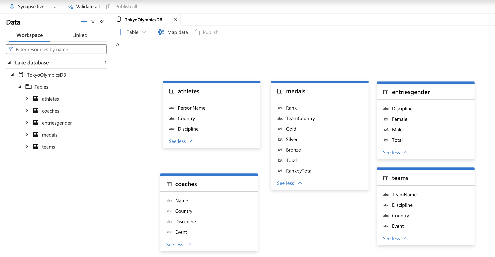

#### Performing Data Analysis on the Data
Here are some sql queries that i ran for analysis

##### Query 1: Top 10 countries with the most gold medals
```sql
SELECT TOP 10 TeamCountry, Gold
FROM medals
ORDER BY Gold DESC;
 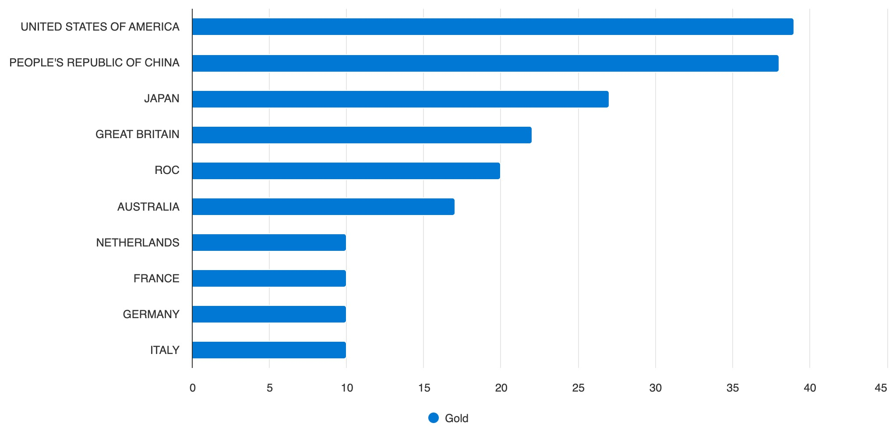

##### Query 2: Number of athletes per discipline
```sql
SELECT a.Discipline, COUNT(*) AS AthleteCount
FROM athletes a
GROUP BY a.Discipline
ORDER BY AthleteCount DESC;
 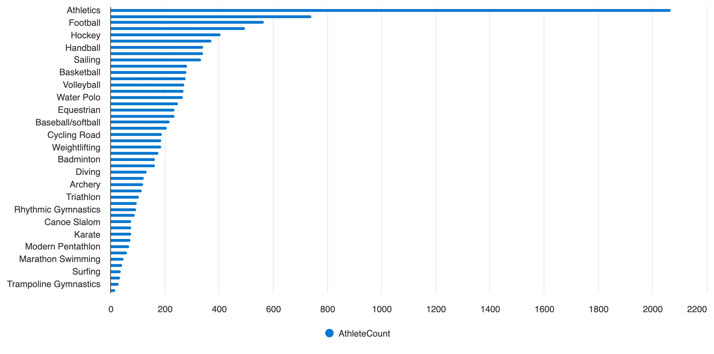

##### Query 3: Disciplines with the highest female participation
```sql
SELECT TOP 5 Discipline, Female
FROM entriesgender
ORDER BY Female DESC;
 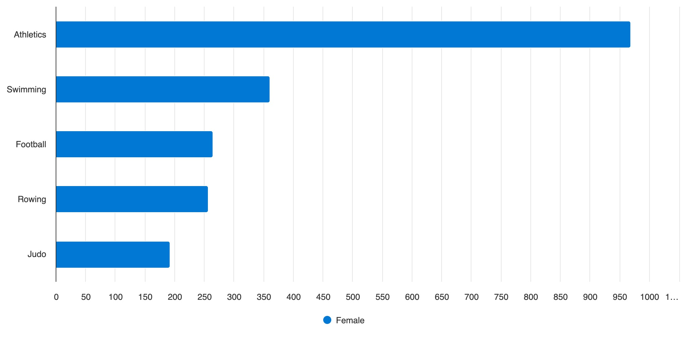

##### Query 4: Countries with the highest medal conversion rate (medals per athlete)
```sql
SELECT TOP 10 m.TeamCountry, COUNT(DISTINCT a.PersonName) AS AthleteCount, COUNT(*) AS TotalMedals,
       COUNT(*) * 1.0 / COUNT(DISTINCT a.PersonName) AS MedalsPerAthlete
FROM medals m
JOIN athletes a ON m.TeamCountry = a.Country
GROUP BY m.TeamCountry
HAVING COUNT(DISTINCT a.PersonName) > 0
ORDER BY MedalsPerAthlete DESC;
 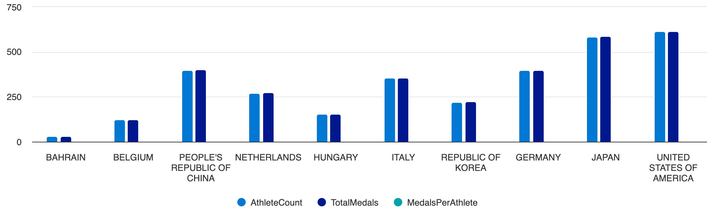

##### Query 5: Events with the highest number of medal events
```sql
SELECT a.PersonName, a.Country, COUNT(DISTINCT a.Discipline) AS DisciplineCount
FROM athletes a
JOIN medals m ON a.Country = m.TeamCountry
GROUP BY a.PersonName, a.Country
HAVING COUNT(DISTINCT a.Discipline) > 1;

##### Query 6: Medals won by each country in each discipline
```sql
SELECT m.TeamCountry, SUM(m.Gold) AS GoldMedals, SUM(m.Silver) AS SilverMedals, SUM(m.Bronze) AS BronzeMedals
FROM medals m
GROUP BY m.TeamCountry
ORDER BY GoldMedals DESC, SilverMedals DESC, BronzeMedals DESC, m.TeamCountry;
 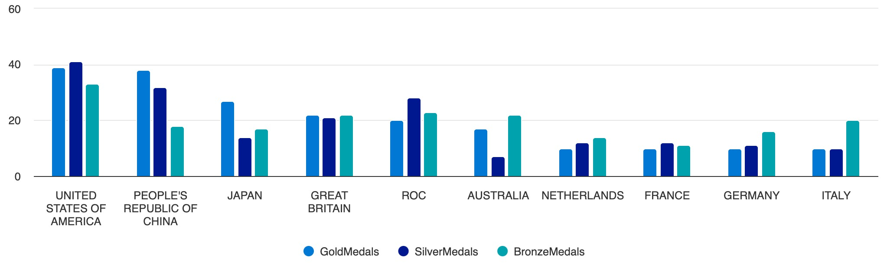

##### Query 7: Disciplines with the highest number of world records broken
```sql
SELECT TOP 10 t.Discipline, COUNT(*) AS MedalCount
FROM medals m
JOIN teams t ON m.TeamCountry = t.Country
GROUP BY t.Discipline
ORDER BY MedalCount DESC;
 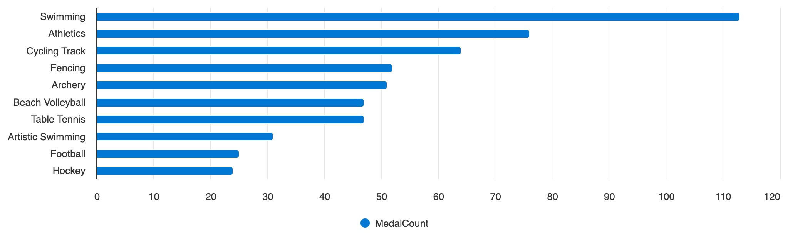

##### Query 8: Countries with the most coaches
```sql
SELECT TOP 10 c.Country, COUNT(*) AS CoachCount
FROM coaches c
GROUP BY c.Country
ORDER BY CoachCount DESC;
 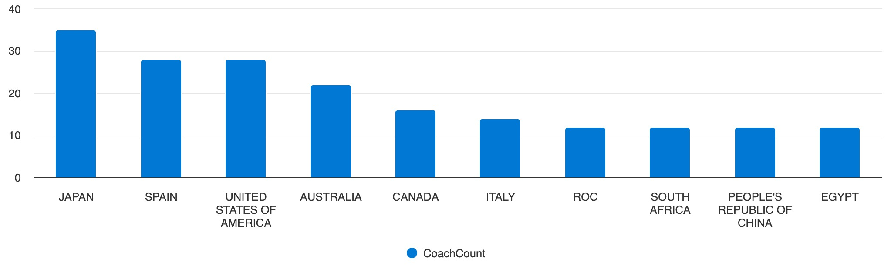

##### Query 9: Gender distribution of athletes by country
```sql
SELECT a.Country,
       SUM(CASE WHEN e.Female > 0 THEN 1 ELSE 0 END) AS FemaleAthletes,
       SUM(CASE WHEN e.Male > 0 THEN 1 ELSE 0 END) AS MaleAthletes
FROM athletes a
JOIN entriesgender e ON a.Discipline = e.Discipline
GROUP BY a.Country;
 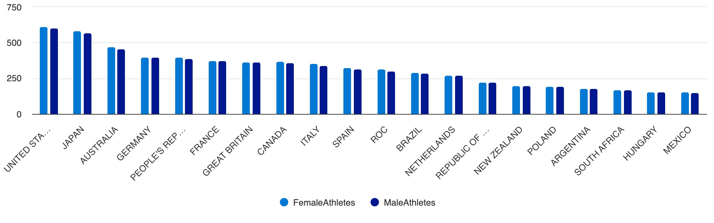

##### Query 10: Coaches with the most gold medals
```sql
SELECT TOP 20 c.Name AS CoachName, c.Country, c.Discipline, COUNT(*) AS GoldMedals
FROM coaches c
JOIN medals m ON c.Country = m.TeamCountry
JOIN teams t ON c.Country = t.Country AND c.Discipline = t.Discipline
WHERE m.Gold = 1
GROUP BY c.Name, c.Country, c.Discipline
ORDER BY GoldMedals DESC;
 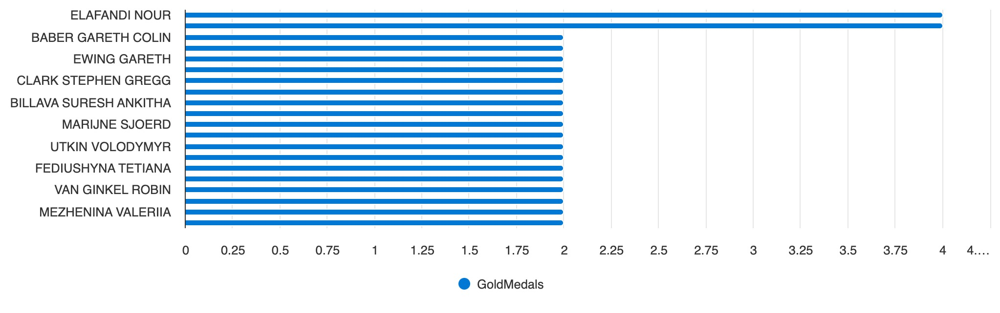


There are other queries in the [sql queries](sql_queries.sql) file as well.

